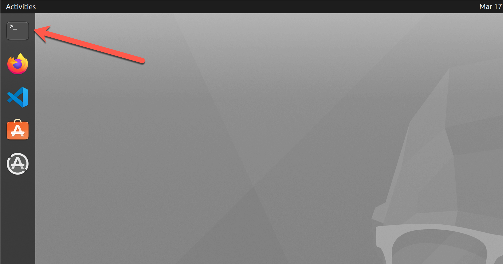
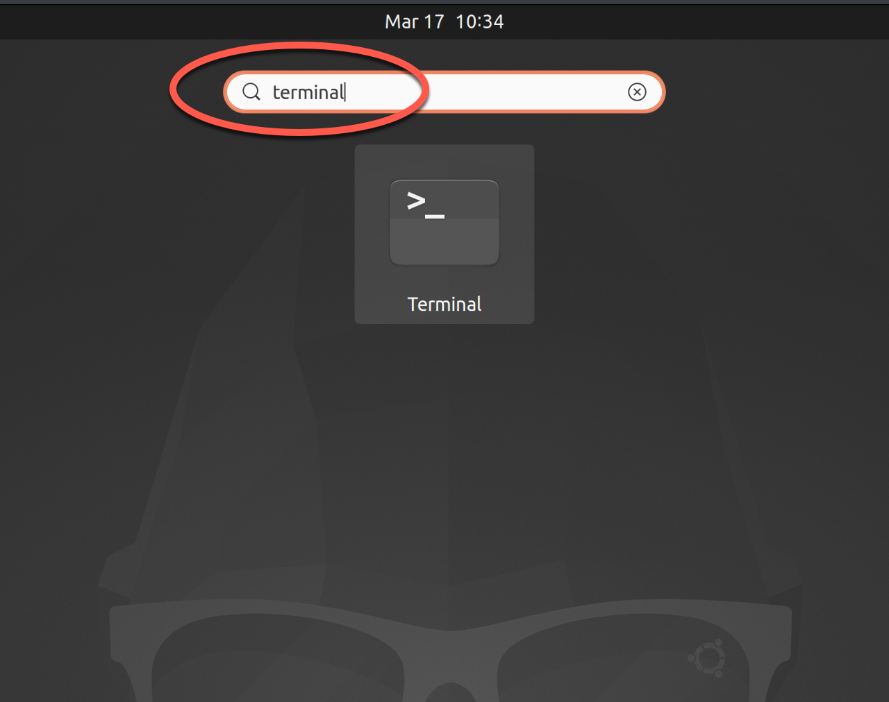

A *secure shell* (SSH) is used for securing network connections between devices. When most people refer to SSH, it is within the context of a remote connection from a client computer to a server. This article covers the basics of connecting from a local workstation running Linux to your Linode over SSH on the *command-line interface* (CLI). Ubuntu is used for this example, but this article should apply to any flavor of Linux.


The domain name and IP address below are reserved by the Internet Assigned Numbers Authority for documentation purposes.


## Before You Begin

1.  Familiarize yourself with our [Getting Started](/docs/getting-started/) guide and complete the steps for setting your Linode's hostname.

2.  This guide covers the basics of connecting over SSH from a client. See the "Harden SSH Access" section of [Securing Your Server](/docs/security/securing-your-server/) to review how to secure SSH on the server's side.

## Connecting to Linode over SSH from a Linux desktop

SSH commands are entered at the CLI. If you run Linux without a desktop environment, skip to step 2.

1.  Open the Terminal application to reach the CLI. In Ubuntu, it's going to be found in one of two places.
    - The first, and easiest, is to find it in the Dock.
    
    - If it's not in the Dock, search for it.
        - Click the Applications icon at the bottom of the Dock.
        
        - Search for "terminal" in the search bar at the top.
        
2.   To connect with a Linode over SSH, type the command and user name at the server's domain or IP address in the shell prompt (`ssh <username>@<domain_or_ip_address>`). For example, if a user named "linode" needed to connect to "example.com" over SSH, `ssh linode@example.com` would be entered and the SSH client will try to connect to example.com on the standard TCP port 22 by default.
    
If the server's SSH port is something other than 22, it needs to be specified in the SSH command. The previous command can be and define the TCP port you need to connect to with `ssh <username>@<domain_or_ip_address> -p <port number>`. For example, if the TCP port you want to connect with is "2222" for example, the example above would then look like `ssh linode@example.com -p 2222`.
    
3.  When you connect with a server for the first time, the SSH client will prompt you to check and verify the host key's fingerprint. This is normal, and results in output such as this:
    
    The authenticity of host ‘example.com (93.184.216.34)’ can't be established.

ECDSA key fingerprint is SHA256:d029f87e3d80f8fd9b1be67c7426b4cc1ff47b4a9d0a84.

Are you sure you want to continue connecting (yes/no)?
    
4. Accept the prompt by entering `yes`, which will result in a one-time warning that looks like this:
    
    Warning: Permanently added 'example' (ECDSA) to the list of known hosts.
    
    
Depending on the flavor of Linux being used on the server and the requirements system administrators may place on the users, mulitple different types of greetings may appear upon logging in (you may be asked to change your password, for example).
    

## Once Connected over SSH

After any greetings, the shell prompt in the terminal will then appear as `<username>@<computername>` (for example, `linode@example-computer`), showing that you are now, within that terminal window, acting as that user on that computer (technically referred to as a "console session"). You can now do what you need to do on that computer.

## Ending the SSH Session

Once finished, log out of the session by typing `exit`. The terminal will then show something like this:


logout
Connection to 93.184.216.34 closed.


At this point, the shell prompt return to the one for the local workstation and the Terminal application can be closed if it's no longer needed.

## Further Reading on SSH

### Unable to connect?

If SSH isn't connecting you to your Linode, it is possible it needs to be looked at on the server. See the guide [Troubleshooting SSH](/docs/guides/troubleshooting-ssh/) for assistance.

### More Security

- Now that you can connect from your Linux machine to the Linode over SSH, save not only time but also make the connection even more secure by using SSH public key authentication. See the guide [Use SSH Public Key Authentication on Linux, macOS, and Windows](/docs/guides/use-public-key-authentication-with-ssh/) for details.

- See the "Harden SSH Access" section of [Securing Your Server](/docs/security/securing-your-server/) to review how to secure SSH on the server's side, and our [Advanced SSH Server Security](/docs/guides/advanced-ssh-server-security/) for more information on making it even more secure.

### More Commands

If you want more details on what can be done with SSH, read the manual page by entering `man ssh` in the Terminal. We also cover some of the more interesting SSH-related commands in [Useful SSH Commands](/docs/guides/useful-ssh-commands).