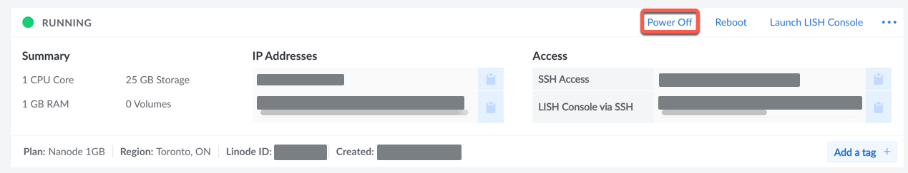
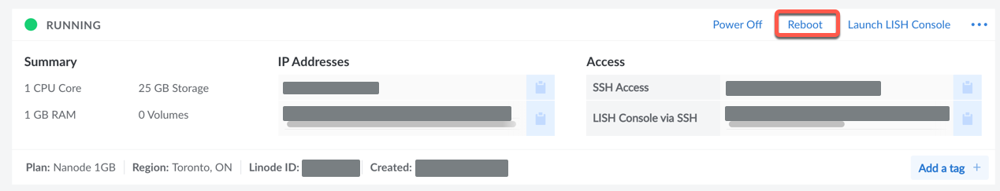

Linux rarely needs to be shut down. From time to time, however, the system will require a reboot for various updates to the kernel or shut down because you need to upgrade it or aren't currently using it (for example). This article covers the different ways to shut down and reboot your Linux-based system, including specifics for a Linode using the web-based Linode Manager.

The `shutdown` command in Linux has two functions: shut down or reboot your Linux system. It also can schedule the shutdown or reboot and broadcast a message to connected users about the shutdown or reboot.


If you're working on the command line in your Linode and `shutdown` isn't working correctly, see the section [How to Shut Down Your Linode](#how-to-shut-down-your-linode) below.


## Before You Begin

1.  Familiarize yourself with our [Getting Started](/docs/getting-started/) guide and have a Linode running.

2.  Update your system: `sudo apt-get update && sudo apt-get upgrade`


This guide is written for a non-root user. Commands that require elevated privileges are prefixed with `sudo`. If you’re not familiar with the `sudo` command, see the [Users and Groups](/docs/tools-reference/linux-users-and-groups/) guide.


## How to Use `shutdown` to Shut Down Linux

If you just need to turn the Linux system completely off (and you're the only user on the system):

1.  Open your Terminal application (if you are in the graphical environment).

2.  At the command prompt, enter `sudo shutdown`.
    -   By default, you have one minute after entering the command until shutdown begins. To immediately shut the system down, enter `sudo shutdown now`.

3.  Enter your password (if prompted).

4.  Once started, you should see output that looks something like this:
    
Shutdown scheduled for Tue 2021-04-20 04:20:57 UTC, use 'shutdown -c' to cancel.


5.  You will then have one minute to save and finish anything on the system.
    -   You can cancel the shutdown by entering `shutdown -c` within the minute.

## How to use `shutdown` to Reboot Linux

If you have installed something requiring the system to restart, like a new kernel, you can use `-r` as an argument by entering `shutdown -r`.

## How to Use `shutdown` to Schedule a Shutdown or Reboot

If you want to shut the system down or reboot it later, you can add a time argument in minutes.

-   To have the system perform a shutdown later, determine how many minutes it needs to be. If it's in 30 minutes, then enter `sudo shutdown +30`.

-   To have the system reboot later, again determine how many minutes it needs to be. If it's in 30 minutes, then enter `sudo shutdown -r +30`.

### Broadcasting a Message

If you need to let logged-in users know you are shutting down or rebooting the system, you can broadcast a message. However, the broadcast must have a scheduling argument tied to it. The message is placed in quotes at the end of the command.

-   If you need to take the system down for emergency maintenance, for example, you could enter `shutdown +5 "Shutting down the server in five minutes for maintenance."`.

-   If there was a vital patch that needed you to reboot the server, you could enter `shutdown -r +5 "Rebooting server in five minutes for important patches."`

## How to Shut Down Your Linode

By default, your Linode should not be shut down from the command line. If you SSH into the Linode and issue the `shutdown` command, you will soon see an event appear in your Linode Manager stating something like this:


Linode ubuntu-xx-xxxx has been booted by the Lassie watchdog service. (Completed in 27 seconds)


That is because, by default, we have Shutdown Watchdog (known as "Lassie") running to keep your Linode up and running. To learn more about Lassie and how to configure it, see the [Configure Shutdown Watchdog](docs/products/tools/monitoring/guides/monitoring-configure-watchdog/) guide.

To properly shut your Linode down:

1.  Log in to the Linode Manager.

2.  Click "Linodes" on the left side.

3.  Choose the Linode you want to shut down and click "Power Off."
    

4.  The Linode will shut down and stay off till turned on again (Lassie will not restart it).

### Rebooting Your Linode

To restart in the Linode Manager:

1.  Log in to the Linode Manager.

2.  Click "Linodes" on the left side.

3.  Choose the Linode you want to shut down and click "Reboot."
    

4.  The Linode will reboot and be available again in a few minutes.